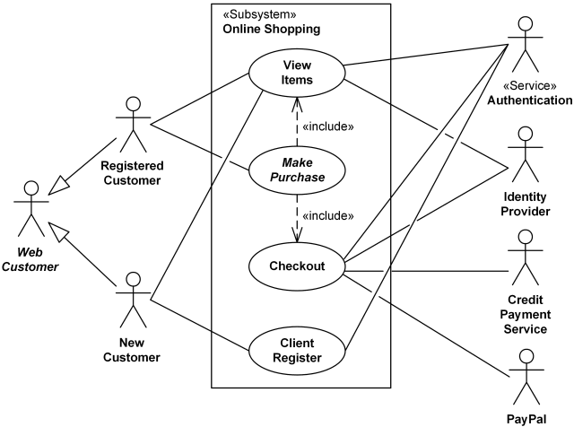
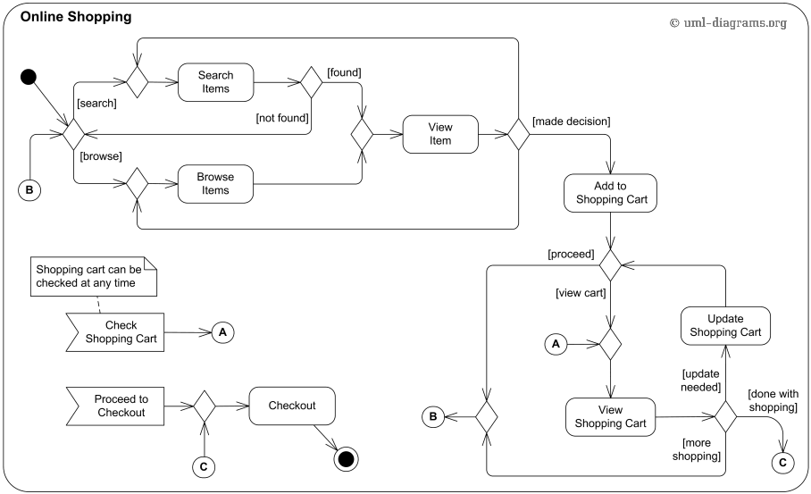

# Diagramas de casos de uso

1. **Nombra y describe brevemente los elementos que se utilizan en un diagrama de casos de uso. Busca información si es necesario.**

   Los tres elementos básicos de los casos de uso son: Actor, Caso de uso y la relación (o asociación).

   

  - ### **Actor** 

    Representa a una persona o grupo de personas que desempeñan un papel en la interacción con el software.

    También puede ser “cualquier elemento” externo que interactúe con el software  para lograr determinados objetivos, como por ejemplo otros sistemas,         productos de software y equipamiento.

   
      Se representan con el siguiente símbolo:

   

   

   

   - ### **Caso de uso**

   Representa una funcionalidad (Conocida en inglés como Feature) que cumple uno o varios requisitos.  Al colocarles nombre es recomendable usar verbos        infinitivos con un  complemento. Por ejemplo “Registrar nuevo cliente” en lugar de “Registro de nuevo cliente”.

   El símbolo del caso de uso en el diagrama es una elipse con su nombre dentro, tal como se muestra a continuación:

   

  

   Opcionalmente, los casos de uso pueden rodearse de un rectángulo que representa los límites del sistema.

   

   - ### **Relación**

   La interacción entre dos casos de uso o de un actor con un caso de uso se  representa por medio de una relación, utilizando una línea o una flecha como    se muestra en la figura:

 
  

   

   

------

2. **Por cada ejemplo de diagrama de casos de uso que aparece en las diapositivas, realiza su interpretación. Escribe la descripción con tus palabras.**

  - Ejemplo 1:
   
     
     

   
     
     
 ------
 - Ejemplo 2:
   
     
     

  

#   Diagramas de secuencia

**Nombra y describe brevemente los elementos que se utilizan en un diagrama de secuencia. Busca información si es necesario.**

Los tres elementos del diagrama de secuencia: Objetos, Mensajes y Tiempo

- #### Objetos

Están representados como rectángulos con un texto subrayado. se  colocan en la parte superior del diagrama, de izquierda a derecha, la  línea punteada que se desprende del rectángulo es conocida como línea de vida del objeto, y junto con esta línea aparece un pequeño rectángulo llamado activación, que representa la ejecución que realiza el objeto. la longitud del rectángulo se interpreta como la duración de la activación.

- #### Mensajes

Es una línea continua que termina con una punta de flecha. Esta pasa  de una línea de vida de un objeto a otra. Un objeto puede enviarse un  mensaje a si mismo.

1. **Mensaje Simple**, que representa la transferencia de un control a otro.
2. **Mensaje Sincrono**, si se envía este mensaje es porque se  necesita una respuesta antes de continuar. Los mensajes sincrónicos se  utilizan para representar llamadas de función ordinarias dentro de un  programa, así como otros tipos de mensaje que se comportan de la misma  manera.
3. **Mensaje Asincrono** es un mensaje que no requiere una respuesta antes de que el 			remitente continúe. Un mensaje asincrónico muestra sólo una llamada del remitente. Se utiliza para representar la comunicación  entre subprocesos diferentes o la creación de un nuevo subproceso.

- #### Tiempo

El tiempo está representado por una progresión vertical. EL tiempo se inicia en la parte superior y avanza hasta la parte inferior, un  mensaje que este en la parte superior ocurrirá antes que un mensaje que  está en la parte inferior.

 [

------

**Por cada ejemplo de diagrama de secuencia que aparece en las diapositivas, realiza su interpretación. Escribe la descripción con tus palabras.**

 - Ejemplo 1:
   
     
     
       
 ------
 - Ejemplo 2:
   
     

#   Diagramas de estados

1. **Nombra y describe brevemente los elementos que se utilizan en un diagrama de estados. Busca información si es necesario.**

   Puedes incluir muchas figuras diferentes en un diagrama de estados,  particularmente si eliges combinarlo con otro diagrama. Esta lista  resume las figuras más comunes que puedes encontrar.

   - ### Pseudoestado de opción

   Un símbolo de diamante que indica una condición dinámica con resultados potenciales ramificados.

   

   - ### Evento

   Una instancia que activa una transición, etiquetada arriba de la  flecha de transición aplicable. En este caso, "fin de clases" es el  evento que activa el final del estado “Siendo instruidos” y el inicio  del estado “Exámenes finales”.

   

   - ### Punto de salida

   El punto en el cual un objeto escapa el estado compuesto o máquina de estados, el cual se indica por medio de un círculo cruzado con una X.  El punto de salida generalmente se usa si el proceso no está  completado, pero tiene que ser escapado por algún error u otro problema.

   

   - ### Primer estado

   Un marcador para el primer estado en el proceso, que se muestra mediante un círculo oscuro con una flecha de transición.

   

   - ### Protección

   Una condición booleana que permite o detiene una transición. Se escribe arriba de la flecha de transición.

   - ### Estado

   Un rectángulo de esquinas redondeadas que indica la naturaleza actual de un objeto.

   

   - ### Subestado

   Un estado contenido dentro de la región de un estado compuesto. En el diagrama de máquina de estados de universidad mostrado a continuación, “Abierto para inscripción” es un subestado en el estado compuesto más grande de “Inscripción”.

   - ### Terminador

   Un círculo con un punto en el interior que indica que un proceso está terminado.

   

   - ### Transición

   Una flecha que corre de un estado a otro, que indica un estado cambiante.

   

   - ### Comportamiento transicional

   Un comportamiento que resulta cuando un estado pasa por una transición. Se escribe arriba de la flecha de transición.

   - ### Disparador

   Un tipo de mensaje que mueve activamente un objeto de estado en  estado. Se escribe arriba de la flecha de transición. En este ejemplo,  “Problema con la reservación” es el disparador que enviaría a la persona a la agencia de viajes del aeropuerto en lugar de al siguiente paso en  el proceso.

   

   ------

2. **Por cada ejemplo de diagrama de estados que aparece en las diapositivas, realiza su interpretación. Escribe la descripción con tus palabras.**

- Ejemplo 1:
   
     
     
       
 ------
 - Ejemplo 2:
   
     

  

#   Diagramas de actividades

1. **Nombra y describe brevemente los elementos que se utilizan en un diagrama de actividades. Busca información si es necesario.**

   Estos diagramas están compuestos por elementos como terminadores, símbolos de procesos, de subprocesos y de decisiones, líneas con  flechas y conectores. Los principales elementos están representados de  la siguiente forma:

   - **Procesos o actividades**. Representados como  rectángulos, se refieren a una acción en un proceso de negocios. Son,  posiblemente, los elementos más importantes de un diagrama de procesos,  los que aparecen siempre, y por eso deben describirse de forma clara y  concisa. Deben ser descritos con una frase única de verbo y sustantivo.  Por ejemplo: “Redactar un nuevo informe para presentar a los accionistas del grupo”.
   - **Subprocesos**. Estos están representados como un  rectángulo con líneas dobles en cada lado. Son partes de procesos padre; así, normalmente forman parte de otros más complejos y sirven para  asignar tareas más simples al diagrama de flujo.
   - **Nodos de decisión**. Están representados mediante un  diamante y son nodos en los que, dependiendo de la respuesta, el árbol  se dirige hacia un camino u otro. Generalmente, responden a la decisión  de “sí” o “no”.
   - **Conectores**. Gráficamente, son pequeños círculos o  cuadros conectores que se etiquetan utilizando letras. Aseguran que  todos los procesos están conectados de forma lógica y correcta en varias páginas.
   - **Líneas de flecha**. Su función es mantener la  coherencia y claridad en un diagrama de procesos. Se dibujan hacia una u otra dirección, normalmente representando el camino por el que fluirá  el diagrama.
   - **Terminadores**. Están representados por un rectángulo con esquinas curvas. Aparecen al inicio y al final de un diagrama de  flujo, e indican la finalización de un diagrama.

   

   

   ------

2. **Por cada ejemplo de diagrama de actividades que aparece en las diapositivas, realiza su interpretación. Escribe la descripción con tus palabras.**

- Ejemplo 1:
   
     
     
       
 ------
- Ejemplo 2:
   
     

